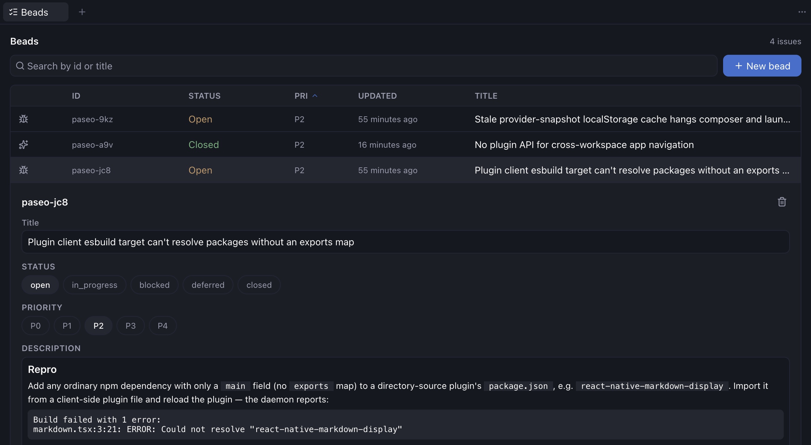

# paseo-beads

> [!WARNING]
> Experimental and naive, not production-ready



A [Paseo](https://github.com/getpaseo/paseo) plugin that wraps [`bd`](https://github.com/gastownhall/beads), the hierarchical,
dependency-aware issue tracker built for agent workflows, into a workspace panel. Paseo has
no built-in task tracker (yet?). But `bd` already does hierarchical IDs, a blocking-dependency graph,
priorities, and it auto-installs agent guidance, so this just brings that into the app instead of a terminal.

It's a thin UI over the real CLI, not a reimplementation: every action shells out to `bd`.

## What it does

- A **Beads** tab in the workspace bar shows a sortable, searchable table of the project's
  issues, ids sorted naturally (`bd-2` before `bd-10`). Sort by any column including issue
  type; **Group** toggles an epic-nested tree (mirrors `bd list`) whose branches
  collapse/expand. Columns drop out as the panel narrows — status shrinks to its `bd` glyph,
  then priority/updated/id fall away — leaving type + title on an ultra-narrow sidebar.
- The search field doubles as a filter: bare words match id/title, `key:value` tokens
  filter (`type:bug`, `status:open`, `priority:1`, `assignee:me`, `parent:bd-3`, a space
  after the colon is fine), and `p0`–`p4` is shorthand for `priority:`. Active filters show
  as removable chips.
- Each row opens an inline detail panel: title, status, priority, type, and a markdown
  description are editable, and a bead can be deleted with a confirm. Status/type options
  come from `bd types` / `bd statuses`, so custom vocab shows up too. A long description
  starts collapsed behind a toggle. Dependency links render as a bulleted list.
- **New bead** takes a title, type, priority, and description.
- In a project without a bd database, a **Run bd init** button initializes it in place
  (`bd init --non-interactive` in the project root).
- On an open, unblocked bead, **Create workspace** spins up a worktree and links it back to
  the bead (`external-ref`), so the panel remembers which workspace picked it up.

## Setup

Install `bd`: https://github.com/gastownhall/beads#-quick-start

Initialize it in your project's root checkout (not a worktree):

```bash
cd /path/to/your/project
bd init
```

Install the plugin and turn on **Enable plugins** under Settings → Plugins:

```bash
paseo plugin add pasteley/paseo-beads
```

## Known problems/limitations

- **Slow.** Every action shells out to a fresh `bd` process, roughly 300ms per click, since
  `bd init` defaults to an embedded engine rather than the sql-server mode.
- **No live updates.** List and detail poll every 5s, no push/watch.
- **No "open workspace" link** on any released Paseo build yet, so no navigation API availible.
- **No reverse link.** A bead knows its workspace, but a workspace doesn't show its bead.
- **Hand-rolled markdown**, not Paseo's real renderer. A small subset of CommonMark.
- **No claim/assignee, comments, bulk actions, or issue tracker correlation.** Use the `bd`
  CLI directly for those.

## Requirements

- Paseo ≥ 0.8.0
- Node ≥ 22 (for `Promise.withResolvers`)
- `bd` on `PATH` (or set `BD_BINARY` to an absolute path)
